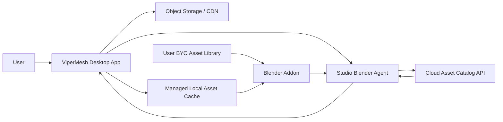

# ViperMesh Local Asset Production Draft

> Status: Draft only
>
> This is a working architecture note for the future managed asset system.
> It is intentionally separate from `docs/future-plans.md` and should not be treated as final.
> Other product features may change the final production shape.

Companion migration note:

- [local-asset-production-stages.md](C:/Users/krist/Desktop/Cursor-Projects/Projects/modelforge/ModelForge/docs/local-asset-production-stages.md)

## Why This Exists

The current local asset flow is correct for development:

- curated assets live on disk
- Blender imports them from local file paths
- the agent searches metadata in `catalog/assets.json`

That works well in development, but it does not answer the long-term production question:

- should every install ship the whole asset library?
- should users manage private libraries?
- how should the app handle search, previews, and downloads at scale?

## Current Constraint

Blender still needs local files at import time.

The ViperMesh agent can decide which asset to use, but the actual import is performed inside the Blender addon, which currently resolves a file path from the local catalog and appends or imports the asset from disk.

That means:

- a cloud database alone is not enough
- cloud metadata is useful
- cloud search is useful
- but the final model file must still exist locally before Blender can import it

## Draft Long-Term Direction

The preferred direction is:

1. Cloud catalog for metadata and search
2. Object storage or CDN for the actual asset files
3. Managed local cache on the user machine
4. Optional BYO asset library override

This avoids bundling a huge asset pack into every install while still satisfying Blender's need for local files.

## Draft Architecture



## Responsibilities

### Cloud Catalog

Should store:

- asset id
- name
- category
- tags
- style
- quality score
- dimensions
- license metadata
- source metadata
- preview URL
- download URL or storage key
- optional import hints such as preferred collection name

Should not store:

- giant binary `.blend` files directly in the metadata database

### Object Storage / CDN

Should store:

- `.blend`
- `.glb`
- other importable asset formats
- preview PNGs or thumbnails

This layer is for delivery, not search logic.

### Managed Local Cache

This is the most likely production answer for ViperMesh-managed assets.

Properties:

- initially empty or very small
- fills on demand
- stores downloaded assets locally for reuse
- may enforce a size cap later
- can be cleaned or revalidated later

Likely Windows example:

```text
%LOCALAPPDATA%\ViperMesh\AssetCache
```

This cache is different from a user-owned asset library.

### Blender Addon

The addon still needs local file access.

It does not need to know about the cloud directly if the desktop app handles downloads and cache resolution first.

In the cleaner long-term model:

- the desktop app resolves catalog search
- the desktop app ensures the requested asset is cached locally
- the addon receives a ready local catalog path and root
- Blender imports from local disk as it does now

### BYO Library

Users should still be able to point ViperMesh at their own asset library.

That path should stay separate from the managed ViperMesh cache:

- managed assets are controlled by ViperMesh
- BYO assets are controlled by the user

## Suggested UX Model

Short-term production-friendly UX:

- auto-fill the managed ViperMesh catalog and root when available
- keep `Library Root` as an advanced override
- allow a user-selected BYO library only when needed

This keeps the default path simple while still supporting private assets.

## Why Not Bundle The Whole Library In The Installer

Bundling everything per install is probably the wrong default because:

- it increases installer size
- it wastes disk on assets the user may never use
- it makes updates heavier
- it complicates licensing and packaging

Bundling only a tiny starter pack is still reasonable later, but the main library should probably be on-demand.

## Role Of Previews

Previews are mainly for UX, not for the core import mechanism.

They help with:

- visual browsing
- manual selection
- click-to-import UX
- debugging search quality
- future drag/drop workflows

They are not required for the agent to function, but they are very valuable for product usability.

## Recommended Future Split

### Managed ViperMesh Assets

Use:

- cloud catalog
- object storage
- local cache
- auto-filled catalog/root in the app

### User BYO Assets

Use:

- local catalog chosen by the user
- local root chosen by the user
- optional merge or multi-source search later

## Open Questions

These are intentionally unresolved:

- whether the desktop app or a backend service should own search ranking
- whether the managed cache should be global or project-scoped
- how asset licensing metadata should be surfaced in the UI
- whether ViperMesh should support multiple simultaneous catalogs later
- whether preview-first manual browsing should live in the desktop app, Blender addon, or both

## Current Recommendation

Until production architecture is closer:

- keep the current local disk workflow
- keep using the curated manifest
- keep the addon importing from local file paths
- avoid overcommitting to a cloud-only design
- treat the cloud catalog plus local cache model as the most likely future direction
